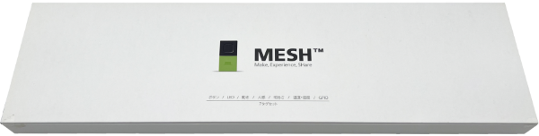
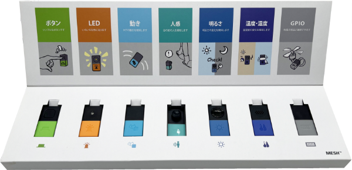
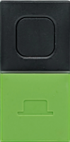
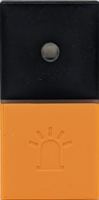
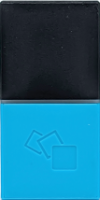
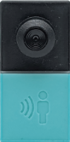
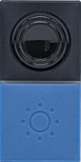
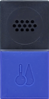
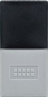
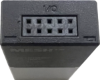

node-sony-mesh
===============

node-sony-mesh は、SONY の IoT ブロック「[MESH](https://meshprj.com/jp/)」をコントロールするための node モジュールです。7 種類すべてのブロックに対応し、ブロックの制御やブロックからのメッセージ受信を行います。





<small>*※ このモジュールは SONY 公式または公認の node モジュールではなく、SONY が一般公開している「[MESH 技術ドキュメント](https://developer.meshprj.com/hc/ja)」を参考に開発した非公式・非公認の node モジュールです。*</small>

<small>*※ MESH ブロックのファームウェアを必ず最新版にアップデートしてください。詳細は[公式サイトの「ブロックソフトウェアバージョンについて」](https://developer.meshprj.com/hc/ja/articles/9950635230873)をご覧ください。*</small>

## 対象のブロック

以下の 7 種類のすべてのブロックをサポートしています。

* [ボタンブロック (MESH-100BU)](https://meshprj.com/jp/products/blocks/MESH-100BU.html)
* [LED ブロック (MESH-100LE)](https://meshprj.com/jp/products/blocks/MESH-100LE.html)
* [動きブロック (MESH-100AC)](https://meshprj.com/jp/products/blocks/MESH-100AC.html)
* [人感ブロック Motion (MESH-100MD)](https://meshprj.com/jp/products/blocks/MESH-100MD.html)
* [明るさブロック (MESH-100PA)](https://meshprj.com/jp/products/blocks/MESH-100PA.html)
* [温度・湿度ブロック (MESH-100TH)](https://meshprj.com/jp/products/blocks/MESH-100TH.html)
* [GPIOブロック (MESH-100GP)](https://meshprj.com/jp/products/blocks/MESH-100GP.html)


## 動作環境

node-sony-mesh は、Raspberry Pi OS や Ubuntu など Linux ベースの OS で動作します。Windows や Mac OS では動作しません。

実際に動作を確認できているハードウェアと OS は以下の通りです。

* [Raspberry Pi](https://www.raspberrypi.com/)
  * [Raspberry Pi 4 Model B](https://www.raspberrypi.com/products/raspberry-pi-4-model-b/)
    * [Raspberry Pi OS 32-bit (Debian Bullseye)](https://www.raspberrypi.com/software/)
  * [Raspberry Pi 3 Model B](https://www.raspberrypi.com/products/raspberry-pi-3-model-b/)
    * [Raspberry Pi OS 32-bit (Debian Bullseye)](https://www.raspberrypi.com/software/)
  * [Raspberry Pi Zero W](https://www.raspberrypi.com/products/raspberry-pi-zero-w/)
    * [Raspberry Pi OS Lite 32-bit (Debian Bullseye)](https://www.raspberrypi.com/software/)
* [ASUS Tinker Board](https://tinker-board.asus.com/jp/product/tinker-board.html)
  * [Tinker Board R2.0](https://tinker-board.asus.com/jp/product/tinker-board-r2.html)
    * [Tinker Board R2.0 Debian 10 V3.0.11](https://tinker-board.asus.com/jp/download-list.html?product=tinker-board-r2)
  * [Tinker Board 2S](https://tinker-board.asus.com/jp/product/tinker-board-2s.html)
    * [Tinker Board 2/2S Debian 10 V2.0.14](https://tinker-board.asus.com/jp/download-list.html?product=tinker-board-2s)
  * [Tinker Board 2](https://tinker-board.asus.com/jp/product/tinker-board-2.html)
    * [Tinker Board 2 Debian 10 V2.0.14](https://tinker-board.asus.com/jp/download-list.html?product=tinker-board-2)
  * [Tinker Board S](https://tinker-board.asus.com/jp/product/tinker-board-s.html)
    * [Tinker Board S Debian 10 V3.0.11](https://tinker-board.asus.com/jp/download-list.html?product=tinker-board-s)
  * [Tinker Board](https://tinker-board.asus.com/jp/product/tinker-board.html)
    * [Tinker Board S R2.0 Debian 10 V3.0.11](https://tinker-board.asus.com/jp/download-list.html?product=tinker-board)
* [BeagleBone](https://beagleboard.org/)
  * [BeagleBone Black Wireless](https://beagleboard.org/black-wireless)
    * [AM3358 Debian 10.3 2020-04-06 4GB SD IoT](https://beagleboard.org/latest-images)


## 依存関係

* [Node.js](https://nodejs.org/en/) 18 +
* [@abandonware/noble](https://github.com/abandonware/noble)

[@abandonware/noble](https://github.com/abandonware/noble) のインストール方法については、[@abandonware/noble](https://github.com/abandonware/noble) のドキュメントを参照してください。

noble はほとんどの Linux 環境では root 権限でないと動作しません。詳細は [@abandonware/noble](https://github.com/abandonware/noble) のドキュメントを参照してください。

## インストール

```
$ cd ~
$ npm install @abandonware/noble
$ npm install node-sony-mesh
```

---------------------------------------
## 目次

* [クイックスタート](#Quick-Start)
  * [MESH ブロックの発見と接続](#Quick-Start-1)
  * [全 MESH ブロックからの通知を受信する](#Quick-Start-2)
  * [計測値を取得する](#Quick-Start-3)
  * [計測値通知を開始する](#Quick-Start-4)
* [`Mesh` オブジェクト](#Mesh-object)
  * [`init()` メソッド](#Mesh-init-method)
  * [`discover()` メソッド](#Mesh-discover-method)
  * [`wait()` method](#Mesh-wait-method)
  * [`discover` イベント](#Mesh-discover-event)
  * [`notify` イベント](#Mesh-notify-event)
* [`MeshBlock` オブジェクト](#MeshBlock-object)
  * [プロパティ](#MeshBlock-properties)
  * [`connect()` メソッド](#MeshBlock-connect-method)
  * [`disconnect()` メソッド](#MeshBlock-disconnect-method)
  * [`turnOnStatusBar()` メソッド](#MeshBlock-turnOnStatusBar-method)
  * [`turnOffStatusBar()` メソッド](#MeshBlock-turnOffStatusBar-method)
  * [`powerOff()` メソッド](#MeshBlock-powerOff-method)
  * [`connect` イベント](#MeshBlock-connect-event)
  * [`disconnect` イベント](#MeshBlock-disconnect-event)
* [`MeshBlockBu` オブジェクト (ボタンブロック)](#MeshBlockBu-object)
  * [`notify` イベント](#MeshBlockBu-notify-event)
* [`MeshBlockLe` オブジェクト (LED ブロック)](#MeshBlockLe-object)
  * [`turnOnLed()` メソッド](#MeshBlockLe-turnOnLed-method)
  * [`turnOffLed()` メソッド](#MeshBlockLe-turnOffLed-method)
  * [`notify` イベント](#MeshBlockLe-notify-event)
* [`MeshBlockAc` オブジェクト (動きブロック)](#MeshBlockAc-object)
  * [`notify` イベント](#MeshBlockAc-notify-event)
* [`MeshBlockMd` オブジェクト (人感ブロック)](#MeshBlockMd-object)
  * [`getCurrentData()` メソッド](#MeshBlockMd-getCurrentData-method)
  * [`startNotification()` メソッド](#MeshBlockMd-startNotification-method)
  * [`stopNotification()` メソッド](#MeshBlockMd-stopNotification-method)
  * [`notify` イベント](#MeshBlockMd-notify-event)
* [`MeshBlockPa` オブジェクト (明るさブロック)](#MeshBlockPa-object)
  * [`getCurrentData()` メソッド](#MeshBlockPa-getCurrentData-method)
  * [`startNotification()` メソッド](#MeshBlockPa-startNotification-method)
  * [`stopNotification()` メソッド](#MeshBlockPa-stopNotification-method)
  * [`notify` イベント](#MeshBlockPa-notify-event)
* [`MeshBlockTh` オブジェクト (温度・湿度ブロック)](#MeshBlockTh-object)
  * [`getCurrentData()` メソッド](#MeshBlockTh-getCurrentData-method)
  * [`startNotification()` メソッド](#MeshBlockTh-startNotification-method)
  * [`stopNotification()` メソッド](#MeshBlockTh-stopNotification-method)
  * [`notify` イベント](#MeshBlockTh-notify-event)
* [`MeshBlockGp` オブジェクト (GPIOブロック)](#MeshBlockGp-object)
  * [ピン配置](#MeshBlockGp-pin-arrangement)
  * [`getDin()` メソッド](#MeshBlockGp-getDin-method)
  * [`startDinNotification()` メソッド](#MeshBlockGp-startDinNotification-method)
  * [`stopDinNotification()` メソッド](#MeshBlockGp-stopDinNotification-method)
  * [`getDout()` メソッド](#MeshBlockGp-getDout-method)
  * [`setDout()` メソッド](#MeshBlockGp-setDout-method)
  * [`getPwm()` メソッド](#MeshBlockGp-getPwm-method)
  * [`setPwm()` メソッド](#MeshBlockGp-setPwm-method)
  * [`getVout()` メソッド](#MeshBlockGp-getVout-method)
  * [`setVout()` メソッド](#MeshBlockGp-setVout-method)
  * [`getAin()` メソッド](#MeshBlockGp-getAin-method)
  * [`startAinNotification()` メソッド](#MeshBlockGp-startAinNotification-method)
  * [`stopAinNotification()` メソッド](#MeshBlockGp-stopAinNotification-method)
  * [`notify` イベント](#MeshBlockGp-notify-event)
* [`MeshBlockMessage` オブジェクト](#MeshBlockMessage-object)
  * [全モデル共通](#MeshBlockMessage-object-common)
  * [ボタンブロック](#MeshBlockMessage-object-BU)
  * [動きブロック](#MeshBlockMessage-object-AC)
  * [人感ブロック](#MeshBlockMessage-object-MD)
  * [明るさブロック](#MeshBlockMessage-object-PA)
  * [温度・湿度ブロック](#MeshBlockMessage-object-TH)
  * [GPIOブロック](#MeshBlockMessage-object-GP)
* [`MeshBlockModel` オブジェクト](#MeshBlockModel-object)
* [リリースノート](#Release-Note)
* [リファレンス](#References)
* [ライセンス](#License)

---------------------------------------
## <a id="Quick-Start">クイックスタート</a>

### <a id="Quick-Start-1">MESH ブロックの発見と接続</a>

このサンプルコードは、MESH ブロックを発見します。そして、発見したブロックに BLE 接続を行い、ブロックに組み込まれているステータスバーと呼ばれる LED を点灯します。そして、BLE 接続を切断します。

```JavaScript
// node-sony-mesh をロードし、`Mesh` コンストラクタオブジェクトを取得
const Mesh = require('node-sony-mesh');

// `Mesh` オブジェクトを生成
const mesh = new Mesh();

(async () => {
  // `Mesh` オブジェクトを初期化
  await mesh.init();

  // MESH ブロックを発見
  const block_list = await mesh.discover();
  console.log(block_list.length + ' 個の MESH ブロックを発見しました。');

  for (const block of block_list) {
    // MESH ブロックの商品名とシリアル番号を出力
    console.log('- ' + block.model.name + ' (' + block.serial + ')');

    // MESH ブロックに BLE 接続
    await block.connect();

    // MESH ブロックのステータスバーの LED を黄色に点灯
    await block.turnOnStatusBar({ r: true, g: true, b: false });

    // MESH ブロックの BLE 接続を切断
    await block.disconnect();
  }
})();
```

上記コードは次のような結果を出力しながら、MESH ブロックに接続し、ステータスバーの LED を黄色に点灯します：

```
3 個の MESH ブロックを発見しました。
- MESH Move (1010296)
- MESH LED (1008966)
- MESH Button (1009323)
```

まず、`Mesh` コンストラクタオブジェクトから [`Mesh`](#Mesh-object) オブジェクトを生成しなければいけません。上記コードでは、変数 `mesh` が [`Mesh`](#Mesh-object) オブジェクトに相当します。

```javascript
const Mesh = require('node-sony-mesh');
const mesh = new Mesh();
```

[`init()`](#Mesh-init-method) メソッドを呼び出すと、[`Mesh`](#Mesh-object) オブジェクトが利用可能な状態になります。このメソッドの呼び出しを忘れないようにしてください。なお、[`Mesh`](#Mesh-object) に実装された非同期型のメソッドは、`Promise` オブジェクトを返します。

```javascript
await mesh.init();
```

[`Mesh`](#Mesh-object) オブジェクトの [`discover()`](#Mesh-discover-method) メソッドは、近隣の MESH ブロックを発見します。この発見処理にはデフォルトで 5 秒間 (5,000 ミリ秒) ほどかかります。

```javascript
const block_list = await mesh.discover();
```

[`discover()`](#Mesh-discover-method) メソッドは、発見した MESH ブロックの配列を返します。この配列の中には、発見した MESH ブロックを表す [`MeshBlock`](#MeshBlock-object) オブジェクトが格納されています。

[`MeshBlock`](#MeshBlock-object) オブジェクトには、その MESH ブロックのモデル名やシリアル番号などのほか、MESH ブロックを操作するメソッドが組み込まれています。

ここでは、モデル名とシリアル番号を出力しています。

```javascript
console.log('- ' + block.model.name + ' (' + block.serial + ')');
```

この時点では、まだ該当の MESH ブロックを操作することはできません。ブロックを操作するためには [`connect()`](#MeshBlock-connect-method) メソッドを呼び出さなければいけません。

```javascript
await block.connect();
```

一度デバイスと接続したら、サポートしているすべてのサービスを呼び出すことができるようになります。ここでは、接続した後、[`MeshBlock`](#MeshBlock-object) オブジェクトの [`turnOnStatusBar()`](#MeshBlock-turnOnStatusBar-method) を使って、ステータスバーの LED を黄色に点灯します。

```javascript
await block.turnOnStatusBar({ r: true, g: true, b: false });
```

### <a id="Quick-Start-2">全 MESH ブロックからの通知を受信する</a>

多くの MESH ブロックは、自身が持つセンサーなどの計測結果を通知します。個々のブロックのオブジェクトから通知を受信することもできますが、次のように、接続中のすべての MESH ブロックから発出される通知メッセージをまとめて受信することができます。


```JavaScript
const Mesh = require('node-sony-mesh');
const mesh = new Mesh();

(async () => {
  // `Mesh` オブジェクトを初期化
  await mesh.init();

  // MESH ブロックを発見
  const block_list = await mesh.discover();
  console.log(block_list.length + ' 個の MESH ブロックを発見しました。');

  for (const block of block_list) {
    // MESH ブロックの商品名とシリアル番号を出力
    console.log('- ' + block.model.name + ' (' + block.serial + ')');

    // MESH ブロックに BLE 接続
    await block.connect();
  }

  // 全 MESH ブロックからの通知を受信する
  mesh.on('notify', (message) => {
    // 通知の内容を出力する
    console.log('---------------------------------');
    console.log(message.model.name + ' (' + message.serial + ')');
    console.log('メッセージタイプ: ' + message.type);
    console.log(JSON.stringify(message.data, null, '  '));
  });
})();
```

MESH ブロックからの通知をまとめて受信するには、それぞれの MESH ブロックに接続してから、[`Mesh`](#Mesh-object) オブジェクトで `notify` イベントのリスナー関数をセットします。

リスナー関数には、受信した通知メッセージを表す [`MeshBlockMessage`](#MeshBlockMessage-object) が引数として引き渡されます。

上記コードは次のような結果を出力します：

```
3 個の MESH ブロックを発見しました。
- MESH LED (1008966)
- MESH Button (1009323)
- MESH Move (1010296)
---------------------------------
MESH LED (1004638)
メッセージタイプ: icon
{
  "press": "single"
}
---------------------------------
MESH Button (1004778)
メッセージタイプ: button
{
  "press": "single"
}
---------------------------------
MESH Move (1005163)
メッセージタイプ: tap
{
  "x": 0.0029296875,
  "y": 0.01171875,
  "z": 1.0244140625
}
```

[`MeshBlockMessage`](#MeshBlockMessage-object) には、通知を発出した MESH ブロックの情報、メッセージタイプ、データが格納されています。MESH ブロックの種類とメッセージタイプの組み合わせによって、データの内容は変わります。詳細については [`MeshBlockMessage`](#MeshBlockMessage-object) の欄をご覧ください。

### <a id="Quick-Start-3">計測値を取得する</a>

人感ブロック、明るさブロック、温度・湿度ブロックでは、内蔵されたセンサーの計測値を取得することができます。次のサンプルは、温度・湿度ブロックから温度・湿度を取り出して出力します。

```JavaScript
const Mesh = require('node-sony-mesh');
const mesh = new Mesh();

(async () => {
  // `Mesh` オブジェクトを初期化
  await mesh.init();

  // 温度・湿度ブロックだけを発見
  const block_list = await mesh.discover({ model: ['TH'] });
  const block = block_list[0];

  if (!block) {
    throw new Error('温度・湿度ブロックが見つかりませんでした。');
  }

  // BLE 接続
  await block.connect();

  // センサー計測結果を取得して出力
  const res = await block.getCurrentData();
  console.log(`- 温度: ${res.temperature} degC`);
  console.log(`- 湿度: ${res.humidity} %RH`);

  // BLE 接続を切断
  await block.disconnect();
})();
```

このサンプルを実行すると、次のような結果が出力されます。

```
- 温度: 26.7 degC
- 湿度: 38 %RH
```

人感ブロック、明るさブロック、温度・湿度ブロックの [`MeshBlock`](#MeshBlock-object) オブジェクトの `getCurrentData()` メソッドを使って、センサーの計測値を取得することができます。取得できる値はブロックによって異なります。[人感ブロックの `getCurrentData()` メソッド](#MeshBlockMd-getCurrentData-method)、[明るさブロックの `getCurrentData()` メソッド](#MeshBlockPa-getCurrentData-method)、[温度・湿度ブロックの `getCurrentData()` メソッド](#MeshBlockTh-getCurrentData-method)の説明をご覧ください。

### <a id="Quick-Start-4">計測値通知を開始する</a>

前述の「[全 MESH ブロックからの通知を受信する](#Quick-Start-2)」のように、アイコンボタンの押下などのすべてのブロックがサポートしているイベント、そして、ボタンブロックのボタン押下と動きブロックの加速度のイベントに関しては、BLE 接続してから [`Mesh`](#Mesh-object) オブジェクト、または、[`MeshBlock`](#MeshBlock-object) オブジェクトで発生する `notify` イベントをリッスンすればメッセージを受信することができます。

一方で、人感ブロック、明るさブロック、温度・湿度ブロックの場合は、通知の開始を指示しないと、それぞれのセンサーの計測値を通知しません。次のサンプルは、人感ブロックを使って、人 (障害物) の検知状態をリアルタイムに出力します。


```javascript
const Mesh = require('node-sony-mesh');
const mesh = new Mesh();

(async () => {
  // `Mesh` オブジェクトを初期化
  await mesh.init();

  // 人感ブロックだけを発見
  const block_list = await mesh.discover({ model: ['MD'] });
  const block = block_list[0];

  if (!block) {
    throw new Error('人感ブロックが見つかりませんでした。');
  }

  // BLE 接続
  await block.connect();

  // 通知を開始
  await block.startNotification();

  // notify イベントのリスナーをセット
  block.on('notify', (message) => {
    if (message.data.state === true) {
      console.log('検知状態になりました');
    } else {
      console.log('未検地状態になりました');
    }
  });
})();
```

このサンプルを実行して、人感ブロックに手をかざしたり離したりすると次のような結果が出力されます。

```
検知状態になりました
検知状態になりました
検知状態になりました
検知状態になりました
未検地状態になりました
```

人感ブロック、明るさブロック、温度・湿度ブロックでは、[`MeshBlock`](#MeshBlock-object) オブジェクトの `startNotification()` メソッドを呼び出すことで通知が開始されます。ブロックによって通知パラメータを指定することができますが、パラメータはブロックによって異なります。また、得られる通知の情報もブロックによって異なります。

それぞれの詳細は、[人感ブロックの `startNotification()` メソッド](#MeshBlockMd-startNotification-method)、[明るさブロックの `startNotification()` メソッド](#MeshBlockPa-startNotification-method)、[温度・湿度ブロックの `startNotification()` メソッド](#MeshBlockTh-startNotification-method)の説明をご覧ください。

---------------------------------------
## <a id="Mesh-object">`Mesh` オブジェクト</a>

node-sony-mesh を使うためには、次のように、node-sony-mesh モジュールをロードしなければいけません：

```JavaScript
const Mesh = require('node-sony-mesh');
```

上記コードから `Mesh` コンストラクタが得られます。その後、次のように、`Mesh` コンストラクタから `Mesh` オブジェクトを生成しなければいけません：

```JavaScript
const mesh = new Mesh();
```

### <a id="Mesh-init-method">`init()` メソッド</a>

`Mesh` オブジェクトは当初は利用することができません。以下のように、`init()` メソッドを使って初期化しなければいけません：

```JavaScript
await mesh.init();
```

`init()` メソッドは `Promise` オブジェクトを返します。`Mesh` オブジェクトが初期化されれば、以降の章で説明するメソッドを呼び出すことができるようになります。

### <a id="Mesh-discover-method">`discover()` メソッド</a>

`discover` メソッドは、近隣の MESH ブロックを発見します。このメソッドは `Promise` オブジェクトを返します。このメソッドは、次の通りのパラメータを含んだハッシュオブジェクトを引数に取ります：

プロパティ    | 型      | 必須 | 説明
:------------|:--------|:-----|:------------
`duration`   | Number  | 任意 | 発見処理の時間 (ミリ秒)。デフォルト値は 5000 (ミリ秒) です。
`model`      | Array   | 任意 | ブロックのモデル ID のリスト (例: `["LE", "PA"]`)

`model` を指定すると、該当のモデルのブロックのみを発見対象とします。モデル ID とブロック名称の対応は下表のとおりです。

モデル ID | ブロック名称
:---------|:---------------
`BU`      | ボタンブロック (MESH-100BU)
`LE`      | LED ブロック (MESH-100LE)
`AC`      | 動きブロック (MESH-100AC)
`MD`      | 人感ブロック (MESH-100MD)
`PA`      | 明るさブロック (MESH-100PA)
`TH`      | 温度・湿度ブロック (MESH-100TH)
`GP`      | GPIO ブロック (MESH-100GP)

下記コードでは、`duration` と `model` が `discover()` メソッドに引き渡されています：

```JavaScript
await mesh.init();
const device_list = mesh.discover({
  duration: 5000,
  model: ['LE']
});
```

もし MESH ブロックが 5 秒で見つかれば、`Array` オブジェクト返されます。その `Array` オブジェクトには、見つかった MESH ブロックを表す [`MeshBlock`](#MeshBlock-object) オブジェクトが含まれています。詳細は "[`MeshBlock`](#MeshBlock-object) オブジェクト" の章をご覧ください。

### <a id="Mesh-wait-method">`wait()` method</a>

`wait()` メソッドは指定のミリ秒間だけ待ちます。このメソッドは待ち時間を表す整数 (ミリ秒) を引数に取ります。このメソッドは `Promise` オブジェクトを返します。

```javascript
await mesh.wait(1000); // 1 秒間待ちます。
```

### <a id="Mesh-discover-event">`discover` イベント</a>

[`Mesh`](#Mesh-object) オブジェクトでは、MESH ブロックが発見されると、`discover` イベントが発出されます。`discover` イベントにリスナー関数をセットすると、そのリスナー関数には [`MeshBlock`](#MeshBlock-object) オブジェクトが引き渡されます。

```JavaScript
// `Mesh` オブジェクトを初期化
await mesh.init();

// discover イベントのリスナーをセット
let cnt = 0;
mesh.on('discover', (block) => {
  console.log('- ' + block.model.name + ' (' + block.serial + ')');
  cnt++;
});

// MESH ブロックの発見処理を開始
await mesh.discover({ duration: 5000 });
console.log('以上 ' + cnt + ' 個の MESH ブロックが発見されました。');
```

上記コードは、次のような結果を出力します：

```
- MESH Move (1010296)
- MESH Button (1009323)
- MESH LED (1008966)
以上 3 個の MESH ブロックが発見されました。
```

### <a id="Mesh-notify-event">`notify` イベント</a>

[`Mesh`](#Mesh-object) オブジェクトでは、接続済みの MESH ブロックから通知を受信すると、`notify` イベントが発出されます。`notify` イベントにリスナー関数をセットすると、そのリスナー関数には [`MeshBlockMessage`](#MeshBlockMessage-object) オブジェクトが引き渡されます。

`notify` イベントの使い方は、クイックスタートの「[全 MESH ブロックからの通知を受信する](#Quick-Start-2)」をご覧ください。

---------------------------------------
## <a id="MeshBlock-object">`MeshBlock` オブジェクト</a>

`MeshBlock` オブジェクトは、[`Mesh`](#Mesh-object) オブジェクトの [`discover()`](#Mesh-discover-method) メソッドを呼び出すことによって発見された MESH ブロックを表します。このオブジェクトのプロパティやメソッドは、すべての MESH ブロックで利用可能です。

### <a id="MeshBlock-properties">プロパティ</a>

`MeshBlock` オブジェクトには以下に挙げられたプロパティが実装されています：

プロパティ       | 型      | 説明
:---------------|:--------|-----------------------------
`id`            | String  | Bluetooth アドレスから `:` を除いた値 (例: `fd26f39c9236`)
`connected`     | Boolean | もしデバイスが接続されていれば、この値は `true` になります。そうでなければ、`false` になります。
`serial`        | String  | シリアル番号 (例: `1010296`)
`model`         | [`MeshBlockModel`](#MeshBlockModel-object)  | MESH ブロックのモデル情報を格納したオブジェクト
`version`       | String  | ファームウェアバージョン (例: `1.2.5`)
`battery`       | Integer | バッテリーレベル (0 ～ 100 %)

`version` および `battery` は、BLE 接続後に有効になります。BLE 接続前は、`version` には空文字列が、`battery` には `0` がセットされます。

次のサンプルコードは、発見された MESH ブロックのシリアル番号とモデル情報を出力します。

```javascript
const Mesh = require('node-sony-mesh');
const mesh = new Mesh();

(async () => {
  await mesh.init();

  // MESH ブロックを発見
  const block_list = await mesh.discover();
  console.log(block_list.length + ' 個の MESH ブロックを発見しました。');

  for (const block of block_list) {
    // MESH ブロックの id とシリアル番号とモデル情報を出力
    console.log('-------------------------------------');
    console.log('- ID          : ' + block.id);
    console.log('- シリアル番号: ' + block.serial);
    console.log('- モデルID    : ' + block.model.id);
    console.log('- モデルタイプ: ' + block.model.type);
    console.log('- モデル番号  : ' + block.model.number);
    console.log('- モデル名    : ' + block.model.name);
  }
})();
```

このサンプルコードは次のような結果を出力します。

```
3 個の MESH ブロックを発見しました。
-------------------------------------
- ID          : d3916e308c44
- シリアル番号: 1004638
- モデルID    : LE
- モデルコード: 0
- モデル番号  : MESH-100LE
- モデル名    : MESH LED
-------------------------------------
- ID          : c72162b040b0
- シリアル番号: 1005163
- モデルID    : AC
- モデルコード: 1
- モデル番号  : MESH-100AC
- モデル名    : MESH Move
-------------------------------------
- ID          : fb4d0a5b1a03
- シリアル番号: 1004778
- モデルID    : BU
- モデルコード: 2
- モデル番号  : MESH-100BU
- モデル名    : MESH Button
```

### <a id="MeshBlock-connect-method">`connect()` メソッド</a>

`connect()` メソッドは、MESH ブロックとの BLE コネクションを確立します。このメソッドは `Promise` オブジェクトを返します。

以下のコードは、最初に発見された MESH ブロックに対して BLE 接続と切断を行います。その際に、接続状態を表す `connected` プロパティの値を出力します。

```JavaScript
// MESH ブロックの発見
const block_list = await mesh.discover();

// 最初に見つかった MESH ブロック
const block = block_list[0];
console.log(block.connected); // false

// MESH ブロックに接続
await block.connect();
console.log(block.connected); // true

// MESH ブロックを切断
await block.disconnect();
console.log(block.connected); // false
```

結果は次のようになります：

```
false
true
false
```

### <a id="MeshBlock-disconnect-method">`disconnect()` メソッド</a>

`disconnect()` メソッドは、MESH ブロックとの接続を切断します。このメソッドは `Promise` オブジェクトを返します。詳細は[前の章](#MeshBlock-connect-method)をご覧ください。


### <a id="MeshBlock-turnOnStatusBar-method">`turnOnStatusBar()` メソッド</a>

`turnOnStatusBar()` メソッドは、MESH ブロックのステータスバー（中央部分の横ライン）の LED を点灯します。このメソッドは `Promise` オブジェクトを返します。このメソッドは、次のパラメータを含んだハッシュオブジェクトを引数に取ります：

プロパティ | 型 | 必須 | 説明
:---------|:-------|:-----|:---------------
`r`       | Boolean | 任意 | 赤色有効フラグ (デフォルト: `true`)
`g`       | Boolean | 任意 | 緑色有効フラグ (デフォルト: `true`)
`b`       | Boolean | 任意 | 青色有効フラグ (デフォルト: `true`)

ステータスバーの LED は RGB の各コンポーネントのレベルを指定することはできず、各コンポーネントの ON/OFF しか指定することができません。指定がなければ、すべてのコンポーネントで `true` がセットされたものとして処理されます。つまり LED は白色で点灯します。

```javascript
await block.turnOnStatusBar();
```

もし黄色で転倒させたい場合は、`r` と `g` に `true` をセットし、`b` に `false` をセットします。

```javascript
await block.turnOnStatusBar({ r: true, g: true, b: false });
```

このメソッドによって LED を点灯してから数秒後に自動的に消灯します。ステータスバーの LED を点灯し続けることはできません。

### <a id="MeshBlock-turnOffStatusBar-method">`turnOffStatusBar()` メソッド</a>

`turnOffStatusBar()` メソッドは、MESH ブロックのステータスバー（中央部分の横ライン）の LED を消灯します。このメソッドは `Promise` オブジェクトを返します。

```javascript
await block.turnOffStatusBar();
```

### <a id="MeshBlock-powerOff-method">`powerOff()` メソッド</a>

`powerOff()` メソッドは MESH ブロックの電源をオフにします。このメソッドは `Promise` オブジェクトを返します。

```javascript
await block.powerOff();
```

### <a id="MeshBlock-connect-event">`connect` イベント</a>

[`connect()`](#MeshBlock-connect-method) メソッドで BLE 接続が完了すると、[`MeshBlock`](#MeshBlock-object) オブジェクトで `connect` イベントが発出されます。

```javascript
block.on('connect', () => {
  console.log('接続しました。');
});
```

### <a id="MeshBlock-disconnect-event">`disconnect` イベント</a>

BLE 接続が切断されると、[`MeshBlock`](#MeshBlock-object) オブジェクトで `disconnect` イベントが発出されます。

```javascript
block.on('disconnect', () => {
  console.log('切断されました。');
});
```

---------------------------------------
## <a id="MeshBlockBu-object">`MeshBlockBu` オブジェクト (ボタンブロック)</a>

`MeshBlockBu` オブジェクトは ボタンブロック (MESH-100BU) を表し、[`MeshBlock`](#MeshBlock-object) オブジェクトを継承しています。このオブジェクトには、ボタンブロック (MESH-100BU) に特化した以下のイベントが追加されています。



### <a id="MeshBlockBu-notify-event">`notify` イベント</a>

接続済みの ボタンブロック (MESH-100BU) から通知を受信すると、`MeshBlockBu` オブジェクトで `notify` イベントが発出されます。`notify` イベントにリスナー関数をセットすると、そのリスナー関数には [`MeshBlockMessage`](#MeshBlockMessage-object) オブジェクトが引き渡されます。

```javascript
const Mesh = require('node-sony-mesh');
const mesh = new Mesh();

(async () => {
  await mesh.init();
  const block_list = await mesh.discover({ model: ['BU'] });
  const block = block_list[0];

  if (!block) {
    throw new Error('No MESH Button was found.');
  }

  // BLE 接続
  await block.connect();

  // notify イベントのリスナーをセット
  block.on('notify', (message) => {
    console.log(message);
  });
})();
```

ボタンブロック (MESH-100BU) のボタンを押すと、次のようなメッセージが出力されます。

```javascript
{
  id: 'fb4d0a5b1a03',
  serial: '1004778',
  model: { id: 'BU', code: 2, number: 'MESH-100BU', name: 'MESH Button' },
  type: 'button',
  data: { press: 'single' }
}
```

ボタンブロック (MESH-100BU) のイベントメッセージの詳細は [`MeshBlockMessage`](#MeshBlockMessage-object-BU) オブジェクトの説明を参照してください。

---------------------------------------
## <a id="MeshBlockLe-object">`MeshBlockLe` オブジェクト (LED ブロック)</a>

`MeshBlockLe` オブジェクトは LED ブロック (MESH-100LE) を表し、[`MeshBlock`](#MeshBlock-object) オブジェクトを継承しています。このオブジェクトには、LED ブロック (MESH-100LE) に特化した以下のメソッドが追加されています。



### <a id="MeshBlockLe-turnOnLed-method">`turnOnLed()` メソッド</a>

`turnOnLed()` メソッドは、LED ブロック (MESH-100LE) の LED を点灯します。このメソッドは `Promise` オブジェクトを返します。このメソッドは、次のパラメータを含んだハッシュオブジェクトを引数に取ります：

プロパティ  | 型      | 必須 | 説明
:----------|:--------|:-----|:---------------
`rgb`      | Array   | 任意 | R, G, B 値 (それぞれ 0 ～ 255 の整数) を含んだ Array オブジェクト (デフォルト: `[255, 255, 255]`)
`duration` | Integer | 任意 | 点灯時間 (デフォルト: `65535` ミリ秒)
`oncycle`  | Integer | 任意 | 点灯サイクル (デフォルト: `65535` ミリ秒)
`offcycle` | Integer | 任意 | 消灯サイクル (デフォルト: `0` ミリ秒)
`pattern`  | String  | 任意 | 点灯パターン (1: ぱっと光る、2: ふわっと光る)

引数を全く指定しなければ、LED は白色でぱっと光り、BLE 接続が切断されたり、[`turnOffLed()`](#MeshBlockLe-turnOffLed-method) メソッドが呼び出されない限り、点灯し続けます。

`duration` (点灯時間) を過ぎても LED は消灯しませんので注意してください。この点灯時間とは、点灯および消灯のサイクルの時間を指しています。`duration` (点灯時間) と `oncycle` (点灯サイクル) と `offcycle` (消灯サイクル) の関係性については、[SONY MESH 技術情報](https://developer.meshprj.com/hc/ja/articles/9231602345497)を参照してください。

次のコードは、LED を黄色でふわっと光るように点灯し、5 秒後に消灯してから BLE を切断します。

```javascript
const Mesh = require('node-sony-mesh');
const mesh = new Mesh();

(async () => {
  await mesh.init();
  const block_list = await mesh.discover({ model: ['LE'] });
  const block = block_list[0];

  if (!block) {
    throw new Error('No MESH LED was found.');
  }

  // BLE 接続
  await block.connect();

  // LED を黄色でふわっと点灯
  await block.turnOnLed({
    rgb: [255, 255, 0],
    pattern: 2
  });

  // 5 秒待つ
  await mesh.wait(5000);

  // 消灯
  await block.turnOffLed();

  // BLE 切断
  await block.disconnect();
}) ();
```

### <a id="MeshBlockLe-turnOffLed-method">`turnOffLed()` メソッド</a>

`turnOffLed()` メソッドは、LED ブロック (MESH-100LE) の LED を消灯します。このメソッドは `Promise` オブジェクトを返します。

使い方については、[`turnOnLed()`](#MeshBlockLe-turnOnLed-method) メソッドのサンプルコードを参照してください。

### <a id="MeshBlockLe-notify-event">`notify` イベント</a>

接続済みの LED ブロック (MESH-100LE) から通知を受信すると、`MeshBlockLe` オブジェクトで `notify` イベントが発出されます。`notify` イベントにリスナー関数をセットすると、そのリスナー関数には [`MeshBlockMessage`](#MeshBlockMessage-object) オブジェクトが引き渡されます。

```javascript
const Mesh = require('node-sony-mesh');
const mesh = new Mesh();

(async () => {
  await mesh.init();
  const block_list = await mesh.discover({ model: ['LE'] });
  const block = block_list[0];

  if (!block) {
    throw new Error('No MESH LED was found.');
  }

  // BLE 接続
  await block.connect();

  // notify イベントのリスナーをセット
  block.on('notify', (message) => {
    console.log(message);
  });
})();
```

LED ブロック (MESH-100LE) のアイコンボタンを押すと、次のようなメッセージが出力されます。

```javascript
{
  id: 'd3916e308c44',
  serial: '1004638',
  model: { id: 'LE', code: 0, number: 'MESH-100LE', name: 'MESH LED' },
  type: 'icon',
  data: { press: 'single' }
}
```

LED ブロック (MESH-100LE) のイベントメッセージの詳細は [`MeshBlockMessage`](#MeshBlockMessage-object) オブジェクトの説明を参照してください。なお、LED ブロック (MESH-100LE) に特化したイベントメッセージはありません。[全モデル共通のイベント](#MeshBlockMessage-object-common)のみが送出されます。

---------------------------------------
## <a id="MeshBlockAc-object">`MeshBlockAc` オブジェクト (動きブロック)</a>

`MeshBlockAc` オブジェクトは 動きブロック (MESH-100AC) を表し、[`MeshBlock`](#MeshBlock-object) オブジェクトを継承しています。このオブジェクトには、動きブロック (MESH-100AC) に特化した以下のイベントが追加されています。



### <a id="MeshBlockAc-notify-event">`notify` イベント</a>

接続済みの 動きブロック (MESH-100AC) から通知を受信すると、`MeshBlockAc` オブジェクトで `notify` イベントが発出されます。`notify` イベントにリスナー関数をセットすると、そのリスナー関数には [`MeshBlockMessage`](#MeshBlockMessage-object) オブジェクトが引き渡されます。

```javascript
const Mesh = require('node-sony-mesh');
const mesh = new Mesh();

(async () => {
  await mesh.init();
  const block_list = await mesh.discover({ model: ['BU'] });
  const block = block_list[0];

  if (!block) {
    throw new Error('No MESH Button was found.');
  }

  // BLE 接続
  await block.connect();

  // notify イベントのリスナーをセット
  block.on('notify', (message) => {
    console.log(message);
  });
})();
```

動きブロック (MESH-100AC) をタップして軽い振動を与えると、次のようなメッセージが出力されます。

```javascript
{
  id: 'c72162b040b0',
  serial: '1005163',
  model: { id: 'AC', code: 1, number: 'MESH-100AC', name: 'MESH Move' },
  type: 'tap',
  data: { x: 0, y: 0.0087890625, z: 0.92578125 }
}
```

動きブロック (MESH-100AC) のイベントメッセージの詳細は [`MeshBlockMessage`](#MeshBlockMessage-object-AC) オブジェクトの説明を参照してください。

---------------------------------------
## <a id="MeshBlockMd-object">`MeshBlockMd` オブジェクト (人感ブロック)</a>

`MeshBlockMd` オブジェクトは 人感ブロック (MESH-100MD) を表し、[`MeshBlock`](#MeshBlock-object) オブジェクトを継承しています。このオブジェクトには、人感ブロック (MESH-100MD) に特化した以下のメソッドとイベントが追加されています。



### <a id="MeshBlockMd-getCurrentData-method">`getCurrentData()` メソッド</a>

`getCurrentData()` メソッドは現在の検知状態を取得します。このメソッドは `Promise` オブジェクトを返します。このメソッドは、次のパラメータを含んだハッシュオブジェクトを引数に取ります：

プロパティ | 型 | 必須 | 説明
:---------|:-------|:-----|:---------------
`dtime`   | Integer | 任意 | 応答時の検知判断時間: 500 ～ 60000 ミリ秒 (デフォルト: 500 ミリ秒)

人感ブロック (MESH-100MD) は、`dtime` に指定する時間だけ過去にさかのぼって障害物を検知したのかを判定し、その結果を返します。例えば `dtime` に `60000` (1 分) を指定すると、過去 1 分に一度でも障害物を検知すれば、たとえ現在障害物を検知していなくても、障害物ありと判定します。

このメソッドは次のプロパティを持ったオブジェクトを返します。

プロパティ名 | 型      | 説明
:-----------|:--------|:------------------------
`state`     | Boolean | 障害物を検知したら `true`、そうでなければ `false` がセットされます。

次のコードは、5 秒おきにこのメソッドを使って状態を取得して、その結果を出力します。応答時の検知判断時間 `dtime` には `60000` (1 分) を指定しています。

```javascript
const Mesh = require('node-sony-mesh');
const mesh = new Mesh();

(async () => {
  await mesh.init();
  const block_list = await mesh.discover({ model: ['MD'] });
  const block = block_list[0];

  if (!block) {
    throw new Error('No MESH Motion was found.');
  }

  // BLE 接続
  await block.connect();

  // 5 秒おきに動き検知状態を取得
  setInterval(async () => {
    const res = await block.getCurrentData({ dtime: 60000 });
    console.log(res);
  }, 5000);
})();
```

このコードを実行し、検知を開始してから手をかざして障害物を検知させると、次のような結果が出力されます。手の動きを止めても、1 分間は `true` が維持されます。

```javascript
{ state: false }
{ state: false }
{ state: true }
{ state: true }
{ state: true }
{ state: true }
```

### <a id="MeshBlockMd-startNotification-method">`startNotification()` メソッド</a>

`startNotification()` メソッドは、人感ブロック (MESH-100MD) の通知を開始します。このメソッドは `Promise` オブジェクトを返します。このメソッドは、次のパラメータを含んだハッシュオブジェクトを引数に取ります：

プロパティ  | 型      | 必須 | 説明
:----------|:--------|:-----|:---------------
`htime`    | Integer | 任意 | 検知時の保持時間: 200 ～ 60000 ミリ秒 (デフォルト: 500 ミリ秒)
`periodic` | Boolean | 任意 | 200 ミり秒間隔通知有効フラグ (デフォルト: `false`)

`htime` (検知時の保持時間) とは、障害物が検知されてから、ふたたび未検知の状態に戻るまでの時間です。`periodic` を指定 (`true` をセット) すると、障害物があろうがなかろうが、200 ミリ秒間隔で通知が行われます。

次のコードは、人感ブロック (MESH-100MD) の通知を開始し、通知メッセージを出力します。

```javascript
const Mesh = require('node-sony-mesh');
const mesh = new Mesh();

(async () => {
  await mesh.init();
  const block_list = await mesh.discover({ model: ['MD'] });
  const block = block_list[0];

  if (!block) {
    throw new Error('No MESH Motion was found.');
  }

  // BLE 接続
  await block.connect();

  // 通知を開始
  await block.startNotification({ htime: 1000 });

  // notify イベントのリスナーをセット
  block.on('notify', (message) => {
    console.log(message);
  });
})();
```

通知を受信すると、`MeshBlockMd` オブジェクト (変数 `block`) で `notify` イベントが発出されます。そのリスナー関数では、通知メッセージを表す [`MeshBlockMessage`](#MeshBlockMessage-object) オブジェクトが引き渡されます。

このコードを実行し、検知を開始してから手をかざして動きを検知させると、次のような結果が出力されます。

```javascript
{
  id: 'd4d9739ecc85',
  serial: '1003408',
  model: { id: 'MD', code: 16, number: 'MESH-100MD', name: 'MESH Motion' },
  type: 'motion',
  data: { state: true }
}
```

人感ブロック (MESH-100MD) のイベントメッセージの詳細は [`MeshBlockMessage`](#MeshBlockMessage-object-MD) オブジェクトの説明を参照してください。

### <a id="MeshBlockMd-stopNotification-method">`stopNotification()` メソッド</a>

`stopNotification()` メソッドは、人感ブロック (MESH-100MD) の通知を停止します。このメソッドは `Promise` オブジェクトを返します。

```javascript
await block.stopNotification();
```

### <a id="MeshBlockMd-notify-event">`notify` イベント</a>

接続済みの人感ブロック (MESH-100MD) から通知を受信すると、`MeshBlockMd` オブジェクトで `notify` イベントが発出されます。`notify` イベントにリスナー関数をセットすると、そのリスナー関数には [`MeshBlockMessage`](#MeshBlockMessage-object) オブジェクトが引き渡されます。

使い方については、[`startNotification()`](#MeshBlockMd-startNotification-method) メソッドのサンプルコードを参照してください。

---------------------------------------
## <a id="MeshBlockPa-object">`MeshBlockPa` オブジェクト (明るさブロック)</a>

`MeshBlockPa` オブジェクトは 明るさブロック (MESH-100PA) を表し、[`MeshBlock`](#MeshBlock-object) オブジェクトを継承しています。このオブジェクトには、明るさブロック (MESH-100PA) に特化した以下のメソッドとイベントが追加されています。



### <a id="MeshBlockPa-getCurrentData-method">`getCurrentData()` メソッド</a>

`getCurrentData()` メソッドは現在のセンサー計測結果を取得します。このメソッドは `Promise` オブジェクトを返します。このメソッドに引数はありません。

このメソッドは次のプロパティを持ったオブジェクトを返します。

プロパティ名   | 型      | 説明
:-------------|:--------|:------------------------
`illuminance` | Integer | 明るさ (単位は lx)
`proximity`   | Integer | 近接度

近接度は明るさブロック (MESH-100PA) の正面の近辺に障害物があると大きな値、障害物がない場合は小さな値になります。

次のコードは、5 秒おきにこのメソッドを使って状態を取得して、その結果を出力します。

```javascript
const Mesh = require('node-sony-mesh');
const mesh = new Mesh();

(async () => {
  await mesh.init();
  const block_list = await mesh.discover({ model: ['PA'] });
  const block = block_list[0];

  if (!block) {
    throw new Error('No MESH Brightness was found.');
  }

  // BLE 接続
  await block.connect();

  // 5 秒おきにセンサー計測結果を取得
  setInterval(async () => {
    const res = await block.getCurrentData();
    console.log(res);
  }, 5000);
})();
```

このコードを実行すると、次のような通知メッセージが出力されます。

```javascript
{ illuminance: 50, proximity: 21 }
```

### <a id="MeshBlockPa-startNotification-method">`startNotification()` メソッド</a>

`startNotification()` メソッドは、明るさブロック (MESH-100PA) の通知を開始します。このメソッドは `Promise` オブジェクトを返します。このメソッドは、次のパラメータを含んだハッシュオブジェクトを引数に取ります：

プロパティ  | 型      | 必須 | 説明
:----------|:--------|:-----|:---------------
`periodic` | Boolean | 任意 | 500 ミり秒間隔通知有効フラグ (デフォルト: `false`)

`periodic` を指定 (`true` をセット) すると、明るさの変化があろうがなかろうが、500 ミリ秒間隔で通知が行われます。

次のコードは、明るさブロック (MESH-100PA) の通知を開始し、通知メッセージを出力します。

```javascript
const Mesh = require('node-sony-mesh');
const mesh = new Mesh();

(async () => {
  await mesh.init();
  const block_list = await mesh.discover({ model: ['PA'] });
  const block = block_list[0];

  if (!block) {
    throw new Error('No MESH Brightness was found.');
  }

  // BLE 接続
  await block.connect();

  // 通知を開始
  await block.startNotification({ periodic: true });

  // notify イベントのリスナーをセット
  block.on('notify', (message) => {
    console.log(message);
  });
})();
```

通知を受信すると、`MeshBlockPa` オブジェクト (変数 `block`) で `notify` イベントが発出されます。そのリスナー関数では、通知メッセージを表す [`MeshBlockMessage`](#MeshBlockMessage-object) オブジェクトが引き渡されます。

このコードを実行し、検知を開始してから手をかざして動きを検知させると、次のような結果が出力されます。

```javascript
{
  id: 'dda82a292d2b',
  serial: '1002563',
  model: { id: 'PA', code: 17, number: 'MESH-100PA', name: 'MESH Brightness' },
  type: 'brightness',
  data: { proximity: 17, illuminance: 230 }
}
```

明るさブロック (MESH-100PA) のイベントメッセージの詳細は [`MeshBlockMessage`](#MeshBlockMessage-object-PA) オブジェクトの説明を参照してください。

### <a id="MeshBlockPa-stopNotification-method">`stopNotification()` メソッド</a>

`stopNotification()` メソッドは、明るさブロック (MESH-100PA) の通知を停止します。このメソッドは `Promise` オブジェクトを返します。

```javascript
await block.stopNotification();
```

### <a id="MeshBlockPa-notify-event">`notify` イベント</a>

接続済みの明るさブロック (MESH-100PA) から通知を受信すると、`MeshBlockPa` オブジェクトで `notify` イベントが発出されます。`notify` イベントにリスナー関数をセットすると、そのリスナー関数には [`MeshBlockMessage`](#MeshBlockMessage-object) オブジェクトが引き渡されます。

使い方については、[`startNotification()`](#MeshBlockPa-startNotification-method) メソッドのサンプルコードを参照してください。

---------------------------------------
## <a id="MeshBlockTh-object">`MeshBlockTh` オブジェクト (温度・湿度ブロック)</a>

`MeshBlockTh` オブジェクトは温度・湿度ブロック (MESH-100TH) を表し、[`MeshBlock`](#MeshBlock-object) オブジェクトを継承しています。このオブジェクトには、温度・湿度ブロック (MESH-100TH) に特化した以下のメソッドとイベントが追加されています。



### <a id="MeshBlockTh-getCurrentData-method">`getCurrentData()` メソッド</a>

`getCurrentData()` メソッドは現在のセンサー計測結果を取得します。このメソッドは `Promise` オブジェクトを返します。このメソッドに引数はありません。

このメソッドは次のプロパティを持ったオブジェクトを返します。

プロパティ名   | 型      | 説明
:-------------|:--------|:------------------------
`temperature` | Float   | 温度 (単位: degC)
`humidity`    | Integer | 相対湿度 (単位: %RH)

次のコードは、5 秒おきにこのメソッドを使って状態を取得して、その結果を出力します。

```javascript
const Mesh = require('node-sony-mesh');
const mesh = new Mesh();

(async () => {
  await mesh.init();
  const block_list = await mesh.discover({ model: ['TH'] });
  const block = block_list[0];

  if (!block) {
    throw new Error('No MESH Brightness was found.');
  }

  // BLE 接続
  await block.connect();

  // 5 秒おきにセンサー計測結果を取得
  setInterval(async () => {
    const res = await block.getCurrentData();
    console.log(res);
  }, 5000);
})();
```

このコードを実行すると、次のような通知メッセージが出力されます。

```javascript
{ temperature: 25.2, humidity: 43 }
```

### <a id="MeshBlockTh-startNotification-method">`startNotification()` メソッド</a>

`startNotification()` メソッドは、温度・湿度ブロック (MESH-100TH) の通知を開始します。このメソッドは `Promise` オブジェクトを返します。このメソッドは、次のパラメータを含んだハッシュオブジェクトを引数に取ります：

プロパティ  | 型      | 必須 | 説明
:----------|:--------|:-----|:---------------
`periodic` | Boolean | 任意 | 50 ミり秒間隔通知有効フラグ (デフォルト: `false`)

`periodic` を指定 (`true` をセット) すると、温度や湿度の変化があろうがなかろうが、50 ミリ秒間隔で通知が行われます。

次のコードは、温度・湿度ブロック (MESH-100TH) の通知を開始し、通知メッセージを出力します。

```javascript
const Mesh = require('node-sony-mesh');
const mesh = new Mesh();

(async () => {
  await mesh.init();
  const block_list = await mesh.discover({ model: ['TH'] });
  const block = block_list[0];

  if (!block) {
    throw new Error('No MESH Temperature & Humidity was found.');
  }

  // BLE 接続
  await block.connect();

  // 通知を開始
  await block.startNotification({ periodic: true });

  // notify イベントのリスナーをセット
  block.on('notify', (message) => {
    console.log(message);
  });
})();
```

通知を受信すると、`MeshBlockTh` オブジェクト (変数 `block`) で `notify` イベントが発出されます。そのリスナー関数では、通知メッセージを表す [`MeshBlockMessage`](#MeshBlockMessage-object) オブジェクトが引き渡されます。

このコードを実行すると、次のような結果が出力されます。

```javascript
{
  id: 'fba457d8079b',
  serial: '1002298',
  model: {
    id: 'TH',
    code: 18,
    number: 'MESH-100TH',
    name: 'MESH Temperature & Humidity'
  },
  type: 'temperature-humidity',
  data: { temperature: 24.1, humidity: 41 }
}
```

温度・湿度ブロック (MESH-100TH) のイベントメッセージの詳細は [`MeshBlockMessage`](#MeshBlockMessage-object-TH) オブジェクトの説明を参照してください。

### <a id="MeshBlockTh-stopNotification-method">`stopNotification()` メソッド</a>

`stopNotification()` メソッドは、温度・湿度ブロック (MESH-100TH) の通知を停止します。このメソッドは `Promise` オブジェクトを返します。

```javascript
await block.stopNotification();
```

### <a id="MeshBlockTh-notify-event">`notify` イベント</a>

接続済みの温度・湿度ブロック (MESH-100TH) から通知を受信すると、`MeshBlockTh` オブジェクトで `notify` イベントが発出されます。`notify` イベントにリスナー関数をセットすると、そのリスナー関数には [`MeshBlockMessage`](#MeshBlockMessage-object) オブジェクトが引き渡されます。

使い方については、[`startNotification()`](#MeshBlockTh-startNotification-method) メソッドのサンプルコードを参照してください。

---------------------------------------
## <a id="MeshBlockGp-object">`MeshBlockGp` オブジェクト (GPIO ブロック)</a>

`MeshBlockGp` オブジェクトは GPIO ブロック (MESH-100GP) を表し、[`MeshBlock`](#MeshBlock-object) オブジェクトを継承しています。このオブジェクトには、GPIO ブロック (MESH-100GP) に特化した以下のメソッドとイベントが追加されています。



### <a id="MeshBlockGp-pin-arrangement">ピン配置</a>

GPIO ブロック (MESH-100GP) にはピン端子が 10 個用意されています。各ピンの用途は以下の通りです。



```
                    I/O
 +-------+-------+-------+-------+-------+
▶| VOUT  | DIN1  | DIN2  | DIN3  | GND   |
 +-------+-------+-------+-------+-------+
 | DOUT1 | DOUT2 | DOUT3 | AIN   | PWM   |
 +-------+-------+-------+-------+-------+
```

各ピンの仕様については[公式サイトの説明](https://support.meshprj.com/hc/ja/articles/212782417)を参照してください。

### <a id="MeshBlockGp-getDin-method">`getDin()` メソッド</a>

`getDin()` メソッドは GPIO ブロック (MESH-100GP) の DIN1 ～ DIN3 端子のデジタル入力の状態 (High または Low) を取得します。このメソッドは `Promise` オブジェクトを返します。このメソッドは次の引数を取ります。

&nbsp; | 引数名  | 型      | 必須 | 説明 
:------|:-------|:--------|:-----|:--------
1      |`pin`   | Integer | 必須 | DIN の番号を指定します。たとえば DIN1 なら `1` を指定します。

このメソッドは、以下のプロパティを持ったオブジェクトを返します。

プロパティ | 型      | 説明
:---------|:--------|:--------
`state`   | Boolean | `true` なら High、`false` なら Low を意味します。

次のコードは、DIN1 のデジタル入力の状態を取得して、結果を出力します。

```javascript
const res = await block.getDin(1);
console.log(res);
```

このコードは次のような結果を出力します。

```javascript
{ state: true }
```

### <a id="MeshBlockGp-startDinNotification-method">`startDinNotification()` メソッド</a>

`startDinNotification()` メソッドは、GPIO ブロック (MESH-100GP) の DIN1 ～ DIN3 端子のデジタル入力の状態 (High または Low) の変化を知らせる通知を開始します。このメソッドは `Promise` オブジェクトを返します。このメソッドに引数はありません。このメソッドを実行すると、DIN1 ～ DIN3 すべての状態変化の通知が開始されます。

次のコードは、DIN1 ～ DIN3 の状態変化の通知を開始し、通知メッセージを出力します。

```javascript
// 通知を開始
await block.startDinNotification();

// notify イベントのリスナーをセット
block.on('notify', (message) => {
  console.log(message);
});
```

通知を受信すると、`MeshBlockGp` オブジェクト (変数 `block`) で `notify` イベントが発出されます。そのリスナー関数では、通知メッセージを表す [`MeshBlockMessage`](#MeshBlockMessage-object) オブジェクトが引き渡されます。

このコードを実行すると、次のような結果が出力されます。

```javascript
{
  id: 'db4316ef4fc4',
  serial: '1004027',
  model: { id: 'GP', code: 9, number: 'MESH-100GP', name: 'MESH GPIO' },
  type: 'din-event',
  data: { pin: 1, state: true }
}
```

GPIO ブロック (MESH-100GP) のイベントメッセージの詳細は [`MeshBlockMessage`](#MeshBlockMessage-object-GP) オブジェクトの説明を参照してください。

### <a id="MeshBlockGp-stopDinNotification-method">`stopDinNotification()` メソッド</a>

`stopDinNotification()` メソッドは、GPIO ブロック (MESH-100GP) の DIN1 ～ DIN3 の状態変化の通知を停止します。このメソッドは `Promise` オブジェクトを返します。

```javascript
await block.stopDinNotification();
```

### <a id="MeshBlockGp-getDout-method">`getDout()` メソッド</a>

`getDout()` メソッドは GPIO ブロック (MESH-100GP) の DOUT1 ～ DOUT3 端子のデジタル出力の状態 (High または Low) を取得します。このメソッドは `Promise` オブジェクトを返します。このメソッドは次の引数を取ります。

&nbsp; | 引数名  | 型      | 必須 | 説明 
:------|:-------|:--------|:-----|:--------
1      |`pin`   | Integer | 必須 | DOUT の番号を指定します。たとえば DOUT1 なら　`1` を指定します。

このメソッドは、以下のプロパティを持ったオブジェクトを返します。

プロパティ | 型      | 説明
:---------|:--------|:--------
`state`   | Boolean | `true` なら High、`false` なら Low を意味します。

次のコードは、DOUT1 のデジタル出力の状態を取得して、結果を出力します。

```javascript
const res = await block.getDout(1);
console.log(res);
```

このコードは次のような結果を出力します。

```javascript
{ state: true }
```

### <a id="MeshBlockGp-setDout-method">`setDout()` メソッド</a>

`setDout()` メソッドは GPIO ブロック (MESH-100GP) の DOUT1 ～ DOUT3 端子のデジタル出力の状態 (High または Low) をセットします。このメソッドは `Promise` オブジェクトを返します。このメソッドは次の引数を取ります。

&nbsp; | 引数名   | 型      | 必須 | 説明 
:------|:--------|:--------|:-----|:--------
1      | `pin`   | Integer | 必須 | DOUT の番号を指定します。たとえば DOUT1 なら　`1` を指定します。
2      | `state` | Boolean | 必須 | High なら `true` を、Low なら `false` を指定します。

次のコードは、DOUT1 のデジタル出力の状態を High にします。

```javascript
await block.setDout(1, true);
```

### <a id="MeshBlockGp-getPwm-method">`getPwm()` メソッド</a>

`getPwm()` メソッドは GPIO ブロック (MESH-100GP) の PWM 端子の出力のレベルを取得します。このメソッドは `Promise` オブジェクトを返します。

このメソッドは、以下のプロパティを持ったオブジェクトを返します。

プロパティ | 型      | 説明
:---------|:--------|:--------
`level`   | Integer | PWM 出力レベル: 0 ～ 255

次のコードは、PWM 出力レベルを取得して、結果を出力します。

```javascript
const res = await block.getPwm();
console.log(res);
```

このコードは次のような結果を出力します。

```javascript
{ level: 250 }
```

### <a id="MeshBlockGp-setPwm-method">`setPwm()` メソッド</a>

`setPwm()` メソッドは GPIO ブロック (MESH-100GP) の PWM 端子の出力レベルをセットします。このメソッドは `Promise` オブジェクトを返します。このメソッドは次の引数を取ります。

&nbsp; | 引数名   | 型      | 必須 | 説明 
:------|:--------|:--------|:-----|:--------
1      | `level` | Integer | 必須 | 出力レベル: 0 ～ 255

次のコードは、PWM の出力レベルを 255 にします。

```javascript
await block.setPwm(255);
```

### <a id="MeshBlockGp-getVout-method">`getVout()` メソッド</a>

`getPwm()` メソッドは GPIO ブロック (MESH-100GP) の VOUT 端子の状態を取得します。このメソッドは `Promise` オブジェクトを返します。

このメソッドは、以下のプロパティを持ったオブジェクトを返します。

プロパティ | 型      | 説明
:---------|:--------|:--------
`state`   | Boolean | VOUT の状態: `true` なら ON、`false` なら OFF

次のコードは、VOUT 出力状態を取得して、結果を出力します。

```javascript
const res = await block.getVout();
console.log(res);
```

このコードは次のような結果を出力します。

```javascript
{ state: true }
```

### <a id="MeshBlockGp-setVout-method">`setVout()` メソッド</a>

`setVout()` メソッドは GPIO ブロック (MESH-100GP) の VOUT 端子の出力を制御します。このメソッドは `Promise` オブジェクトを返します。このメソッドは次の引数を取ります。

&nbsp; | 引数名   | 型      | 必須 | 説明 
:------|:--------|:--------|:-----|:--------
1      | `state` | Boolean | 必須 | `true`: ON、`false`: OFF

次のコードは、VOUT の出力を ON にします。

```javascript
await block.setVout(true);
```

### <a id="MeshBlockGp-getAin-method">`getAin()` メソッド</a>

`getAin()` メソッドは GPIO ブロック (MESH-100GP) の AIN 端子のアナログ入力のレベルを取得します。このメソッドは `Promise` オブジェクトを返します。

このメソッドは、以下のプロパティを持ったオブジェクトを返します。

プロパティ | 型      | 説明
:---------|:--------|:--------
`level`   | Float   | 入力レベル (0.0 ～ 3.0 V)

次のコードは、AIN のアナログ入力のレベルを取得して、結果を出力します。

```javascript
const res = await block.getAin();
console.log(res);
```

このコードは次のような結果を出力します。

```javascript
{ level: 2.13 }
```

### <a id="MeshBlockGp-startAinNotification-method">`startAinNotification()` メソッド</a>

`startAinNotification()` メソッドは、GPIO ブロック (MESH-100GP) の AIN 端子のアナログ入力のレベルの変化を知らせる通知を開始します。このメソッドは `Promise` オブジェクトを返します。このメソッドに引数はありません。

次のコードは、AIN の状態変化の通知を開始し、通知メッセージを出力します。

```javascript
// 通知を開始
await block.startAinNotification();

// notify イベントのリスナーをセット
block.on('notify', (message) => {
  console.log(message);
});
```

通知を受信すると、`MeshBlockGp` オブジェクト (変数 `block`) で `notify` イベントが発出されます。そのリスナー関数では、通知メッセージを表す [`MeshBlockMessage`](#MeshBlockMessage-object) オブジェクトが引き渡されます。

このコードを実行すると、次のような結果が出力されます。

```javascript
{
  id: 'db4316ef4fc4',
  serial: '1004027',
  model: { id: 'GP', code: 9, number: 'MESH-100GP', name: 'MESH GPIO' },
  type: 'ain-state',
  data: { pin: 1, level: 2.21 }
}
```

GPIO ブロック (MESH-100GP) のイベントメッセージの詳細は [`MeshBlockMessage`](#MeshBlockMessage-object-GP) オブジェクトの説明を参照してください。

### <a id="MeshBlockGp-stopAinNotification-method">`stopAinNotification()` メソッド</a>

`stopAinNotification()` メソッドは、GPIO ブロック (MESH-100GP) の AIN のレベルの変化の通知を停止します。このメソッドは `Promise` オブジェクトを返します。

```javascript
await block.stopAinNotification();
```

### <a id="MeshBlockGp-notify-event">`notify` イベント</a>

接続済みのGPIO ブロック (MESH-100GP) から通知を受信すると、`MeshBlockGp` オブジェクトで `notify` イベントが発出されます。`notify` イベントにリスナー関数をセットすると、そのリスナー関数には [`MeshBlockMessage`](#MeshBlockMessage-object) オブジェクトが引き渡されます。

使い方については、[`startDinNotification()`](#MeshBlockGp-startDinNotification-method) メソッドと [`startAinNotification()`](#MeshBlockGp-startAinNotification-method) メソッドのサンプルコードを参照してください。

---------------------------------------
## <a id="MeshBlockMessage-object">`MeshBlockMessage` オブジェクト</a>

[`Mesh`](#Mesh-object) オブジェクトの [`notify`](#Mesh-notify-event) イベント、および、[`MeshBlock`](#MeshBlock-object) オブジェクトの `notify` イベントが発出されたとき、リスナー関数に `MeshBlockMessage` オブジェクトが引き渡されます。

`MeshBlockMessage` オブジェクトは次のプロパティを持ちます。

プロパティ | 型     | 説明
:---------|:-------|-----------------------------
`id`      | String | Bluetooth アドレスから `:` を除いた値 (例: `fd26f39c9236`)
`serial`  | String | シリアル番号 (例: `1010296`)
`model`   | [`MeshBlockModel`](#MeshBlockModel-object) | MESH ブロックのモデル情報を格納したオブジェクト
`type `   | String | メッセージタイプ
`data`    | Object | 通知のデータ

`data` の内容は、どのモデルの MESH ブロックが、どのメッセージタイプ `type` の通知を発したのかによって変わります。

次の例は、ボタンブロックのボタンを押したときに受信したメッセージです。

```javascript
{
  id: 'fb4d0a5b1a03',
  serial: '1004778',
  model: { id: 'BU', code: 2, number: 'MESH-100BU', name: 'MESH Button' },
  type: 'button',
  data: { press: 'single' }
}
```

以下に、MESH ブロックのモデルごとに、`type` と `data` の対応を示します。

### <a id="MeshBlockMessage-object-common">全モデル共通</a>

#### 定時通信 (メッセージタイプ: `periodicreport`)

この通知は、MESH ブロックに BLE 接続してから切断するまで定期的に送られてきます。通知内容はバッテリーレベルです。

プロパティ | 型     | 説明
:---------|:-------|-----------------------------
`battery` | Integer | バッテリー残量 (%)

```javascript
{
  id: 'c72162b040b0',
  serial: '1005163',
  model: { id: 'AC', code: 1, number: 'MESH-100AC', name: 'MESH Move' },
  type: 'periodicreport',
  data: { battery: 100 }
}
```

バッテリーレベルは 10, 20, 30, ..., 100 といった具合に 10 刻みの値となります。

#### アイコン押し検知 (メッセージタイプ: `icon`)

アイコン (MESH ブロック下部のアイコンが刻印された領域) を押すと、このイベントの通知が送られてきます。

プロパティ | 型     | 説明
:---------|:-------|-----------------------------
`press`   | String | `single` (1 回押し)、`long` (長回押し) のいずれか

```javascript
{
  id: 'c72162b040b0',
  serial: '1005163',
  model: { id: 'AC', code: 1, number: 'MESH-100AC', name: 'MESH Move' },
  type: 'icon',
  data: { press: 'single' }
}
```

<small>*※ SONY が一般公開している「[MESH 技術ドキュメント](https://developer.meshprj.com/hc/ja)」では、この[長押し](https://developer.meshprj.com/hc/ja/articles/8286379681945#h_01GBRS46YKGKCBYZZM6JY94NVV)が規定されているものの、アイコンを長押しすると電源が OFF になってしまうため、実際にはこの通知を受け取ることはできませんでした。*</small>

#### ブロック基本情報通知 (メッセージタイプ: `blockbasicinfo`)

このイベントは、BLE 接続した直後に、ブロックのモデル情報、シリアルナンバー、ファームウェアバージョンなど通知します。

プロパティ | 型      | 説明
:---------|:--------|-----------------------------
`model`   | [`MeshBlockModel`](#MeshBlockModel-object) | MESH ブロックのモデル情報を格納したオブジェクト
`serial`  | String  | シリアル番号 (例: `1010296`)
`version` | String  | ファームウェアバージョン (例: `1.2.5`)
`battery` | Integer | バッテリー残量 (%)

バッテリー残量は 10, 20, 30, ..., 100 といった具合に 10 刻みの値となります。

```javascript
{
  id: 'c72162b040b0',
  serial: '1005163',
  model: { id: 'AC', code: 1, number: 'MESH-100AC', name: 'MESH Move' },
  type: 'blockbasicinfo',
  data: {
    model: { code: 1, number: 'MESH-100AC', name: 'MESH Move' },
    serial: '1005163',
    version: '1.2.5',
    battery: 100
  }
}
```

### <a id="MeshBlockMessage-object-BU">ボタンブロック</a>

#### ボタン押し検知 (メッセージタイプ: `button`)

ボタンを 1 回押すと、このイベントの通知が送られてきます。

プロパティ | 型     | 説明
:---------|:-------|-----------------------------
`press`   | String | `single` (1 回押し)、`long` (長回押し)、`double` (2 回押し) のいずれか

```javascript
{
  id: 'fb4d0a5b1a03',
  serial: '1004778',
  model: { id: 'BU', code: 2, number: 'MESH-100BU', name: 'MESH Button' },
  type: 'button',
  data: { press: 'single' }
}
```

### <a id="MeshBlockMessage-object-AC">動きブロック</a>

#### タップイベント検知 (メッセージタイプ: `tap`)

MESH Move が振動を感知したら、このイベントの通知が送られてきます。

プロパティ | 型     | 説明
:---------|:-------|-----------------------------
`x`       | Number | x方向加速度 (G)
`y`       | Number | y方向加速度 (G)
`z`       | Number | z方向加速度 (G)

```javascript
{
  id: 'c72162b040b0',
  serial: '1005163',
  model: { id: 'AC', code: 1, number: 'MESH-100AC', name: 'MESH Move' },
  type: 'tap',
  data: { x: 0.0048828125, y: 0.0146484375, z: 1.044921875 }
}
```

#### シェイクイベント検知 (メッセージタイプ: `shake`)

MESH Move が振られたときに、このイベントの通知が送られてきます。

プロパティ | 型     | 説明
:---------|:-------|-----------------------------
`x`       | Number | x方向加速度 (G)
`y`       | Number | y方向加速度 (G)
`z`       | Number | z方向加速度 (G)

```javascript
{
  id: 'c72162b040b0',
  serial: '1005163',
  model: { id: 'AC', code: 1, number: 'MESH-100AC', name: 'MESH Move' },
  event: 'shake',
  data: { x: 0.2744140625, y: -0.072265625, z: 0.6650390625 }
}
```

#### フリップイベント検知 (メッセージタイプ: `flip`)

MESH Move がひっくり返されたときに、このイベントの通知が送られてきます。

プロパティ | 型     | 説明
:---------|:-------|-----------------------------
`x`       | Number | x方向加速度 (G)
`y`       | Number | y方向加速度 (G)
`z`       | Number | z方向加速度 (G)

```javascript
{
  id: 'c72162b040b0',
  serial: '1005163',
  model: { id: 'AC', code: 1, number: 'MESH-100AC', name: 'MESH Move' },
  type: 'shake',
  data: { x: 0.0068359375, y: 0.01171875, z: 0.9912109375 }
}
```

#### オリエンテーションイベント検知 (メッセージタイプ: `orientation`)

MESH Move の向きが変わったときに、このイベントの通知が送られてきます。

プロパティ | 型     | 説明
:---------|:-------|-----------------------------
`orientation` | Integer | 上を向いている面を表す整数
`x`       | Number | x方向加速度 (G)
`y`       | Number | y方向加速度 (G)
`z`       | Number | z方向加速度 (G)

`orientation` の値の意味は下表のとおりです。

値 | 意味
:--|:-----------------------
`1` | 左面が上
`2` | 下面が上
`3` | 表面が上
`4` | 裏面が上
`5` | 上面が上
`6` | 右面が上

```javascript
{
  id: 'c72162b040b0',
  serial: '1005163',
  model: { id: 'AC', code: 1, number: 'MESH-100AC', name: 'MESH Move' },
  type: 'orientation',
  data: { orientation: 3, x: 0.00390625, y: 0.0126953125, z: 0.9921875 }
}
```

### <a id="MeshBlockMessage-object-MD">人感ブロック</a>

人感ブロックの場合、BLE 接続しただけでは通知メッセージを受け取ることができません。BLE 接続の後、[startNotification()](#MeshBlockMd-startNotification-method) メソッドで通知を開始してください。

#### 人物 (障害物) 検知 (メッセージタイプ: `motion`)

人感ブロックが人物 (障害物) を検知または検知しなくなったとき、このイベントの通知が送られてきます。

プロパティ | 型      | 説明
:---------|:--------|-----------------------------
`state`   | Boolean | `true`: 検知、`false`: 未検知

```javascript
{
  id: 'd4d9739ecc85',
  serial: '1003408',
  model: { id: 'MD', code: 16, number: 'MESH-100MD', name: 'MESH Motion' },
  type: 'motion',
  data: { state: true }
}
```

### <a id="MeshBlockMessage-object-PA">明るさブロック</a>

明るさブロックの場合、BLE 接続しただけでは通知メッセージを受け取ることができません。BLE 接続の後、[startNotification()](#MeshBlockPa-startNotification-method) メソッドで通知を開始してください。

#### 明るさ検知 (メッセージタイプ: `brightness`)

明るさブロックが明るさを検知すると、このイベント通知が送られてきます。

プロパティ名   | 型      | 説明
:-------------|:--------|:------------------------
`illuminance` | Integer | 明るさ (単位は lx)
`proximity`   | Integer | 近接度

近接度は明るさブロック (MESH-100PA) の正面の近辺に障害物があると大きな値、障害物がない場合は小さな値になります。

```javascript
{
  id: 'dda82a292d2b',
  serial: '1002563',
  model: { id: 'PA', code: 17, number: 'MESH-100PA', name: 'MESH Brightness' },
  type: 'brightness',
  data: { proximity: 17, illuminance: 260 }
}
```

### <a id="MeshBlockMessage-object-TH">温度・湿度ブロック</a>

温度・湿度ブロックの場合、BLE 接続しただけでは通知メッセージを受け取ることができません。BLE 接続の後、[startNotification()](#MeshBlockTh-startNotification-method) メソッドで通知を開始してください。

#### 温度・湿度検知 (メッセージタイプ: `temperature-humidity`)

温度・湿度ブロックが温度・湿度を検知すると、このイベント通知が送られてきます。

プロパティ名   | 型      | 説明
:-------------|:--------|:------------------------
`temperature` | Float   | 温度 (単位: degC)
`humidity`    | Integer | 相対湿度 (単位: %RH)

```javascript
{
  id: 'fba457d8079b',
  serial: '1002298',
  model: {
    id: 'TH',
    code: 18,
    number: 'MESH-100TH',
    name: 'MESH Temperature & Humidity'
  },
  type: 'temperature-humidity',
  data: { temperature: 23.9, humidity: 43 }
}
```

### <a id="MeshBlockMessage-object-GP">GPIOブロック</a>

GPIO ブロック (MESH-100GP) の場合、BLE 接続しただけでは以下の通知メッセージを受け取ることができません。BLE 接続の後、[startDinNotification()](#MeshBlockGp-startDinNotification-method) メソッド、または、[startAinNotification()](#MeshBlockGp-startAinNotification-method) メソッドで通知を開始してください。

#### デジタル入力のイベント通知 (メッセージタイプ: `din-event`)

GPIO ブロック (MESH-100GP) で DIN1 ～ DIN3 端子のデジタル入力の状態 (High または Low) の変化があると、このイベント通知が送られてきます。

プロパティ名 | 型      | 説明
:-----------|:--------|:------------------------
`pin`       | Integer | DIN 端子の番号 (1 ～ 3)
`state`     | Boolean | `true`: High、`false`: Low

```javascript
{
  id: 'db4316ef4fc4',
  serial: '1004027',
  model: { id: 'GP', code: 9, number: 'MESH-100GP', name: 'MESH GPIO' },
  type: 'din-event',
  data: { pin: 1, state: true }
}
```

#### アナログ入力のイベント通知 (メッセージタイプ: `ain-event`)

GPIO ブロック (MESH-100GP) で AIN 端子のアナログ入力のレベル (電圧) の変化があると、このイベント通知が送られてきます。

プロパティ名 | 型      | 説明
:-----------|:--------|:------------------------
`pin`       | Integer | AIN 端子の番号 (1 固定)
`level`     | Float   | レベル (電圧): 0.0 ～ 3.0 V

```javascript
{
  id: 'db4316ef4fc4',
  serial: '1004027',
  model: { id: 'GP', code: 9, number: 'MESH-100GP', name: 'MESH GPIO' },
  type: 'ain-state',
  data: { pin: 1, level: 2.21 }
}
```

---------------------------------------
## <a id="MeshBlockModel-object">`MeshBlockModel` オブジェクト</a>

`MeshBlockModel` オブジェクトは、MESH ブロックのモデル情報を格納したオブジェクトです。このオブジェクトには以下のプロパティがセットされています:

プロパティ       | 型      | 説明
:---------------|:--------|-----------------------------
`id`            | String  | モデル ID (モデルを識別する 2 文字のアルファベット)
`code`          | Integer | モデルコード (モデルを識別する数値)
`number`        | String  | モデル番号
`name`          | String  | モデル名

MESH ブロックのモデルは 7 種類あり、上記のモデル情報の組み合わせは下表のとおりです。

日本語製品名       | `id` | `code` | `number`   | `name`
:------------------|:-----|:-------|:-----------|:------------
LED ブロック       | `LE` | `0x00` | MESH-100LE | MESH LED
動きブロック       | `AC` | `0x01` | MESH-100AC | MESH Move
ボタンブロック     | `BU` | `0x02` | MESH-100BU | MESH Button
GPIOブロック       | `GP` | `0x09` | MESH-100GP | MESH GPIO
人感ブロック       | `MD` | `0x10` | MESH-100MD | MESH Motion
明るさブロック     | `PA` | `0x11` | MESH-100PA | MESH Brightness
温度・湿度ブロック | `TH` | `0x12` | MESH-100TH | MESH Temperature & Humidity

---------------------------------------
## <a id="Release-Note">リリースノート</a>

* v0.1.0 (2022-12-11)
  * 初回リリース

---------------------------------------
## <a id="References">リファレンス</a>

* [SONY MESH 公式サイト](https://meshprj.com/jp/)
* [MESH 技術ドキュメント](https://developer.meshprj.com/hc/ja)

---------------------------------------
## <a id="License">ライセンス</a>

The MIT License (MIT)

Copyright (c) 2022 Futomi Hatano

